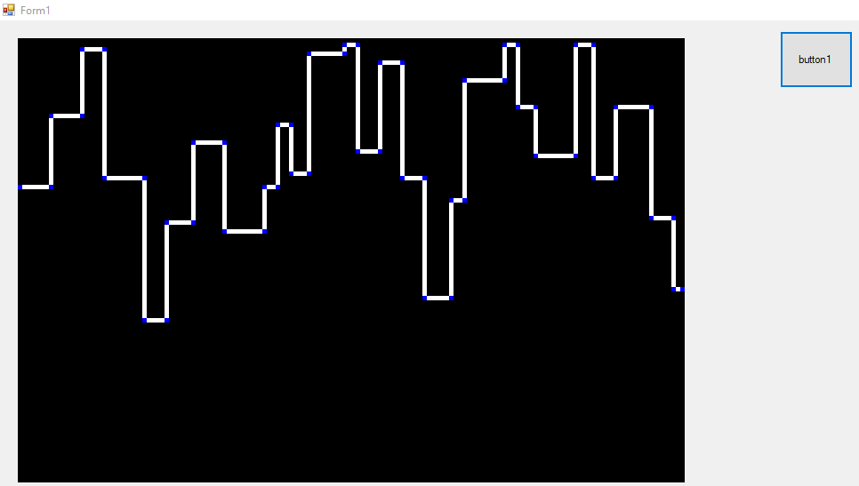
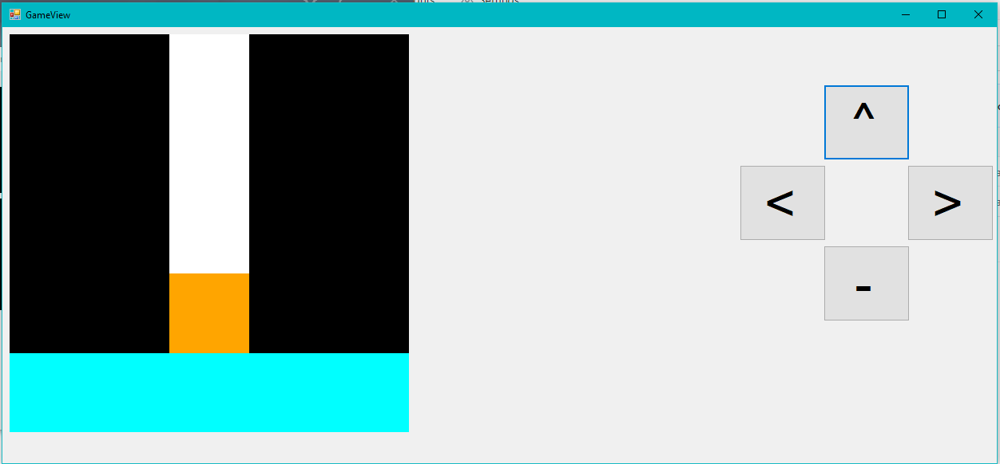
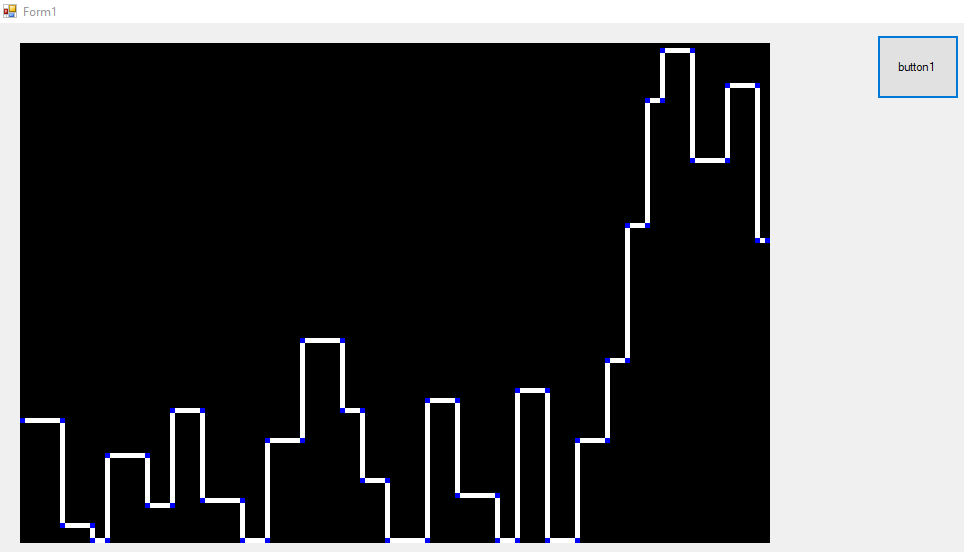

# Labyrinth-algorithm
I developed this project to develop the algorithm of the labyrinth game that will be developed in the future.

# Project content.
- Generating random labyrinths.
- Visual test of the operability of the algorithm.
- In the created labyrinth, the points where the player can go are visualized.

# [Click](https://vimeo.com/568468250) for the preview video of the project

# Algorithm Structure

The algorithm has a parametric structure.

- The "GameLevel" parameter is considered the difficulty level of the game.
- The "MapLenght" parameter specifies the labyrinth size in width and height.
- The "MinHorizantal" parameter specifies the minimum amount of random feed in the horizontal position.
- The "MaxHorizantal" parameter specifies the maximum amount of random feed in the horizontal position.
- The "MinVertical" parameter specifies the minimum amount of random feed in the vertical position.
- The "MaxVertical"  parameter specifies the maximum amount of random feed in the vertical position.

# Algorithm Working Principle

- x=0 as the starting point and y is a random value between 0 and the labyrinth height.
- Horizontal or vertical advancing direction is chosen randomly. (There is no negative value horizontally.)
- Horizontal or vertical progression amount is selected among the minimum and maximum values ​​specified in the algorithm structure.
- Progress is stopped if the step to be moved exceeds the size of the labyrinth.
- If the Y value is equal to the labyrinth width, it is marked as the end point and the algorithm is stopped.
- All progression points are listed as labyrinth path.

# Project View

## Random labyrinth view

## Mobile view

## Random labyrinth view

